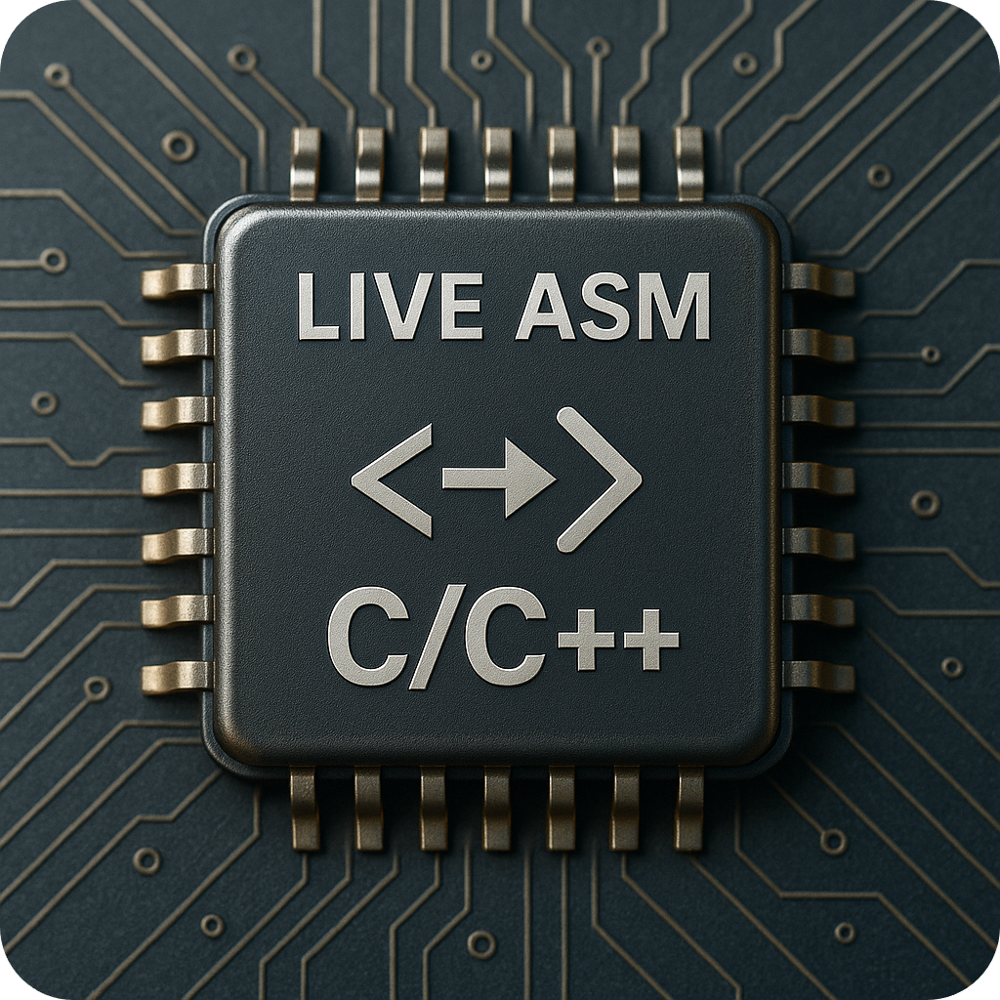
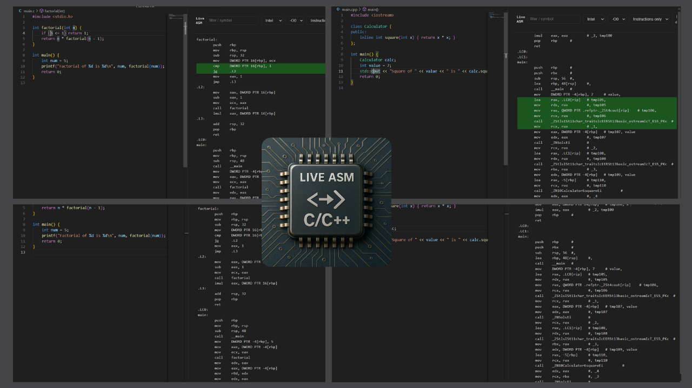
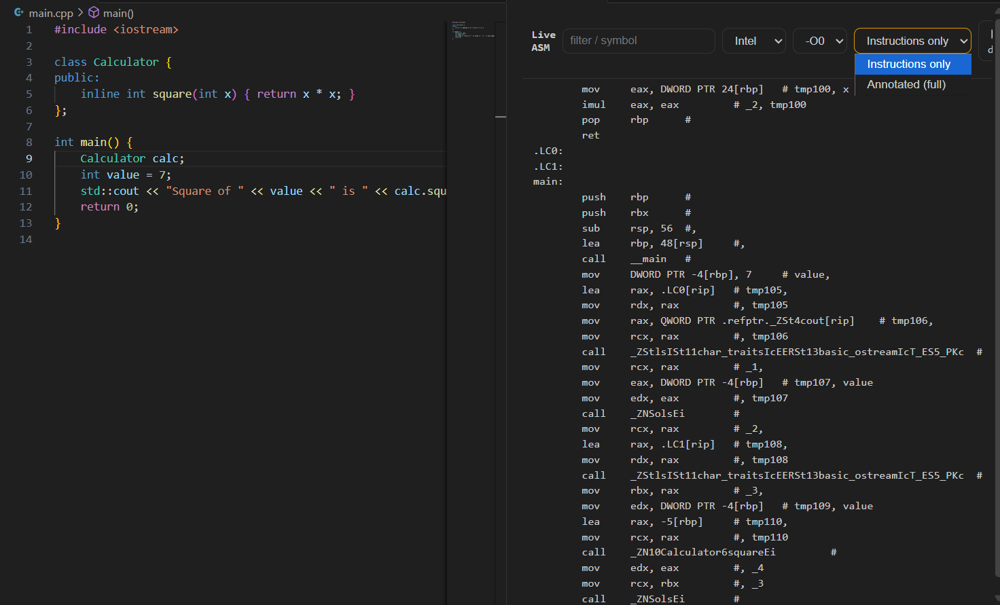
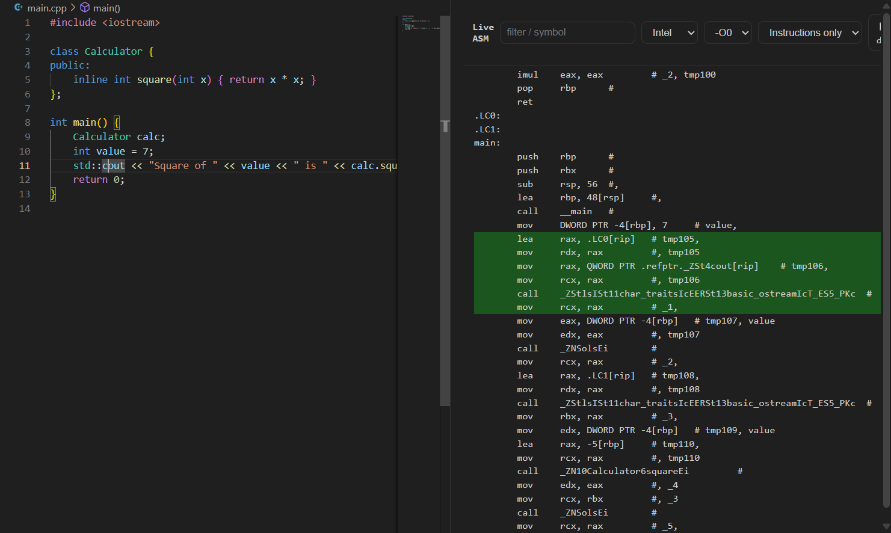

<h1 align=center> </h1>

<p align=center ><i>Live Assembly Extension</i></p>
<p align="center"><i>Live assembly view for C/C++ inside Visual Studio Code.</i></p>
<p align="center">
   <a href="https://marketplace.visualstudio.com/items?itemName=skt1803.live-asm">
     Install from Visual Studio Marketplace
  </a>
</p>

<div align=center>
    
    
    
   
</div>

<div align="center">
       
    
    
</div>


<br/>


---
## Introduction

**Live ASM: C/C++** is a Visual Studio Code extension that shows **live assembly output** side-by-side with your C/C++ source code.  
It compiles your file in the background and keeps the assembly view in sync as you edit, so you can immediately see how each line of code translates into machine-level instructions.

Use it to:
- Learn assembly by experimenting with small C/C++ snippets
- Inspect how different **optimization levels (`-O0`…`-O3`)** change the generated code
- Debug performance-critical sections and understand compiler behaviour

---
## Features

- **Live ASM view** → updates automatically when you edit your C/C++ code.  
- **Two modes**  
  - *Instructions only* → clean, instruction-focused output.  
  - *Annotated (full)* → includes directives, labels, and comments.  
- **Hide directives option** → filter out `.loc`, `.file`, `.section` and similar compiler boilerplate.  
- **Intel / AT&T syntax toggle** → switch between two popular assembly notations.  
- **Optimization levels** → compare `-O0`, `-O1`, `-O2`, `-O3` outputs instantly.  
- **Code ↔ ASM mapping** → clicking a source line highlights the corresponding assembly block.  
- **Copy button** → quickly copy assembly output.  
- **Rebuild button** → manually trigger rebuild.
---
## Built With

- **VS Code Webview API** → extension UI
- **React + Hooks** → modern frontend inside the webview
- **CSS (theme-aware)** → integrates with light/dark themes
- **GCC / Clang** → backend compilers generating the assembly

---
## Installation

Clone the repository:
```powershell
git clone https://github.com/SKT1803/live-assembly-extension.git
cd live-assembly-extension
```  

Install dependencies:
```powershell
npm install
```  

Run in VS Code development mode:

1. Open the folder in VS Code.
2. Press F5 → a new Extension Development Host window will open.
3. Open a C/C++ file and activate Live ASM panel.
---

## Usage

- Open any C/C++ source file.

- Press **Ctrl+Alt+A**  or open **Command Palette** (`Ctrl+Shift+P`) → search for:
```powershell
Live ASM: Open Panel
```
The assembly output will update live as you edit code.

---

## Settings

Add compiler settings to your `settings.json`:

```jsonc
{
  "liveAsm.compilerPath": "C:\\\\msys64\\\\mingw64\\\\bin\\\\gcc.exe",
  "liveAsm.extraArgs": ""
}
```

- **compilerPath** → path to GCC/Clang compiler.
- **extraArgs** → optional extra arguments passed to the compiler (default: none).

---
## Preview (C, C++)

<table>
  <tr>
    <td></td>
    <td></td>
  </tr>

   <tr>
    <td></td>
    <td></td>
  </tr>
</table>


