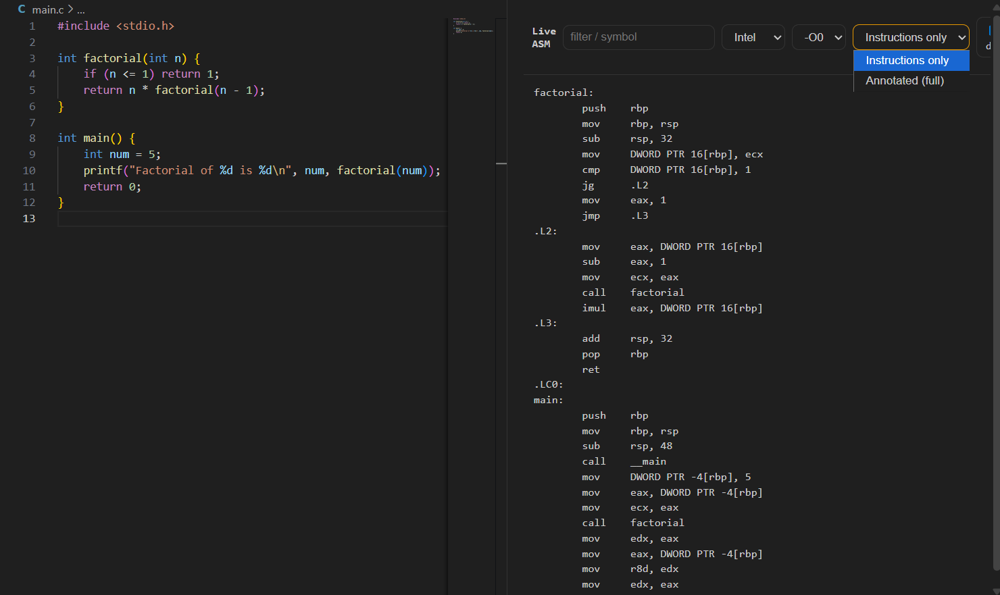
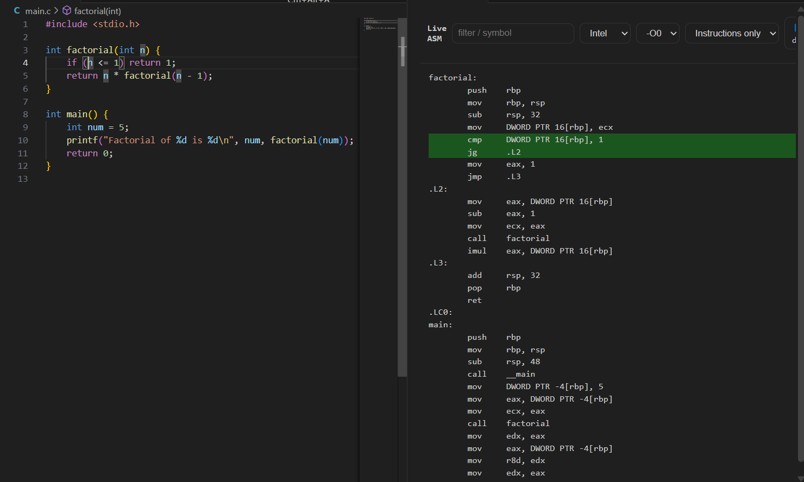

# Live Assembly Extension

A Visual Studio Code extension that shows **live assembly output** while you code in C/C++.  
It creates an interactive mapping between your source code and the generated assembly, making **learning and debugging easier**.

👉 [Install from Visual Studio Marketplace](https://marketplace.visualstudio.com/items?itemName=skt1803.live-asm)

---

## ✨ Features

- **Live ASM view** → updates automatically when you edit your C/C++ code.  
- **Two modes**  
  - *Instructions only* → clean, instruction-focused output.  
  - *Annotated (full)* → includes directives, labels, and comments.  
- **Hide directives option** → filter out `.loc`, `.file`, `.section` and similar compiler boilerplate.  
- **Intel / AT&T syntax toggle** → switch between two popular assembly notations.  
- **Optimization levels** → compare `-O0`, `-O1`, `-O2`, `-O3` outputs instantly.  
- **Code ↔ ASM mapping** → clicking a source line highlights the corresponding assembly block.  
- **Copy button** → quickly copy assembly output.  
- **Rebuild button** → manually trigger rebuild.  

---

## 🛠 Built With

- **VS Code Webview API** → extension UI
- **React + Hooks** → modern frontend inside the webview
- **CSS (theme-aware)** → integrates with light/dark themes
- **GCC / Clang** → backend compilers generating the assembly

---
## 🚀 Installation

Clone the repository:
```powershell
git clone https://github.com/SKT1803/live-assembly-extension.git
cd live-assembly-extension
```  

Install dependencies:
```powershell
npm install
```  

Run in VS Code development mode:

1. Open the folder in VS Code.
2. Press F5 → a new Extension Development Host window will open.
3. Open a C/C++ file and activate Live ASM panel.
---

## Usage

- Open any C/C++ source file.

- Press **Ctrl+Alt+A**  or open **Command Palette** (`Ctrl+Shift+P`) → search for:
```powershell
Live ASM: Open Panel
```
The assembly output will update live as you edit code.

---

## ⚙️ Settings

Add compiler settings to your `settings.json`:

```powershell
{
  "liveAsm.compilerPath": "C:\\\\msys64\\\\mingw64\\\\bin\\\\gcc.exe",
  "liveAsm.extraArgs": ""
}
```

- **compilerPath** → path to GCC/Clang compiler.
- **extraArgs** → optional extra arguments passed to the compiler (default: none).
---

## 📷 Screenshots

<table>
  <tr>
    <td></td>
  </tr>
    <tr>
    <td></td>
  </tr>
</table>

---
## License

This project is licensed under the MIT License.
